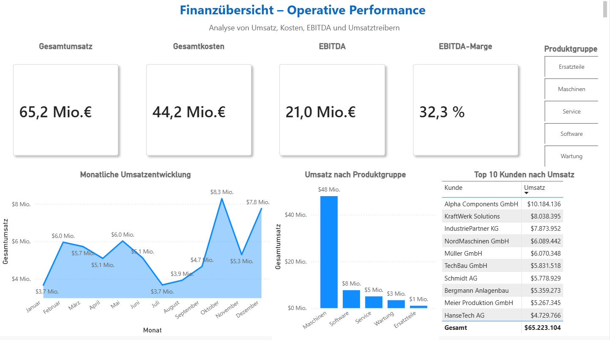
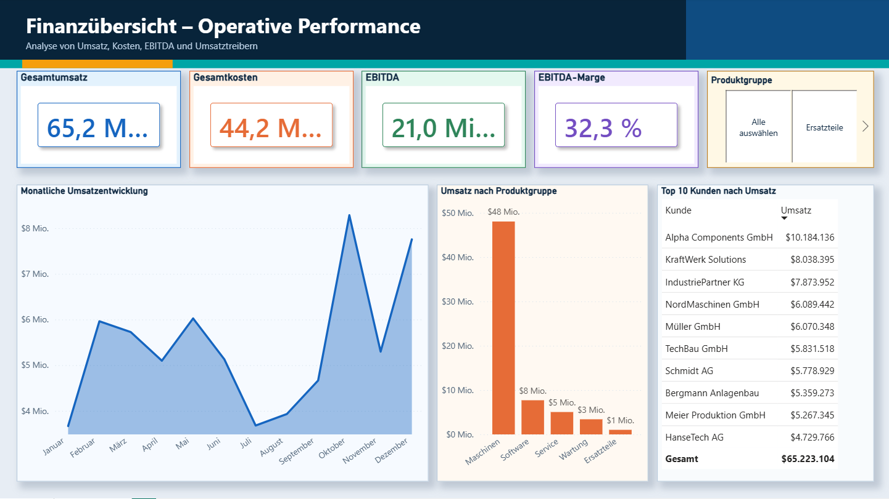
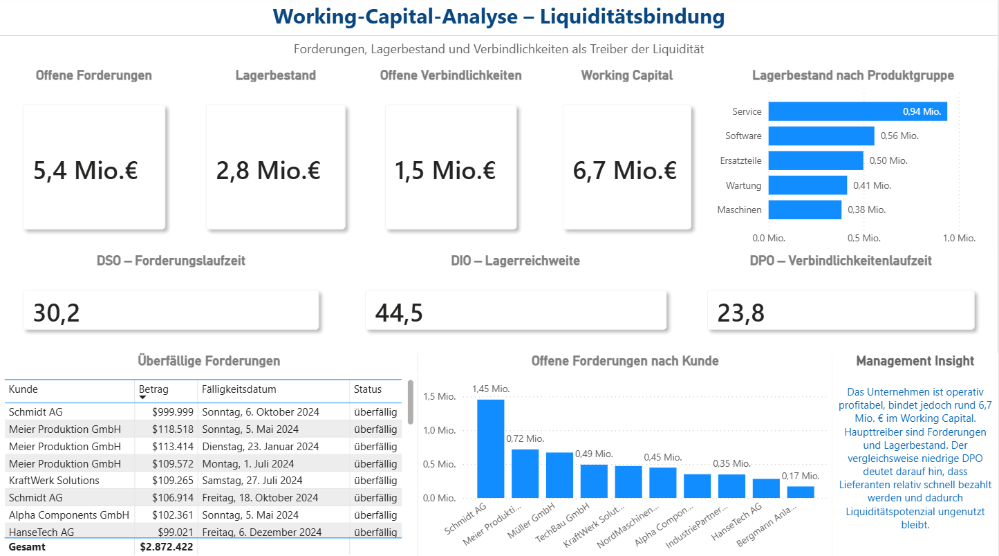

# FTI Data & AI Krisenanalyse - Mueller Maschinenbau GmbH

## Projektueberblick

Dieses Projekt ist eine fiktive, consulting-nahe Data-&AI-Krisenanalyse eines mittelstaendischen Maschinenbauunternehmens. Es zeigt einen End-to-End-Workflow von synthetischer Datengenerierung ueber Datenbereinigung, SQL-Kennzahlen und Power BI bis hin zu einer Management Summary.

Die Mueller Maschinenbau GmbH ist operativ profitabel, bindet jedoch relevante Liquiditaet im Working Capital. Besonders Forderungen und Lagerbestand wirken als Liquiditaetstreiber. Ziel des Projekts ist es, diese Situation datenbasiert zu analysieren und managementgerecht zu visualisieren.

Das Projekt dient als Portfolio-Nachweis fuer Rollen im Bereich Data Analytics, AI Consulting, Digital Transformation und Business Technology Consulting.

## Aktuelle Dashboard-Version

Die aktuell empfohlene Power-BI-Datei ist:

`dashboards/fti_krisenanalyse_dashboard_design_color.pbix`

Diese Version enthaelt das ueberarbeitete farbige Dashboard-Design mit:

- farbigen Header-Bereichen
- getoenten KPI-Karten
- klarerer visueller Trennung zwischen Finanzuebersicht und Working Capital
- modernerem Executive-Dashboard-Look
- beibehaltenem fachlichen Aufbau und unveraenderten Kennzahlen

## Dashboard-Versionen

| Datei | Zweck |
|---|---|
| `dashboards/fti_krisenanalyse_dashboard.pbix` | Urspruengliche Dashboard-Version |
| `dashboards/fti_krisenanalyse_dashboard_design_improved.pbix` | Erste Design-Verbesserung mit saubererem Layout und konsistenteren Abstaenden |
| `dashboards/fti_krisenanalyse_dashboard_design_color.pbix` | Aktuelle Version mit verbessertem Farbkonzept |

Die aelteren Dateien bleiben bewusst im Repository, damit die Design-Entwicklung nachvollziehbar bleibt.

## Design-Entwicklung

Die Screenshots dokumentieren, wie sich das Dashboard visuell weiterentwickelt hat.

### 1. Ausgangsversion

| Finanzuebersicht | Working Capital |
|---|---|
|  |  |

### 2. Erste Layout-Verbesserung

Diese Version reduziert den "plain" wirkenden Aufbau durch bessere Abstaende, klarere Visual-Gruppierung und eine ruhigere Seitenstruktur.


| Seite | Empfohlener Dateiname |
|---|---|
| Finanzuebersicht | `assets/screenshots/03_layout_finanzuebersicht.png` |
| Working Capital | `assets/screenshots/04_layout_working_capital.png` |

### 3. Farbige finale Version

Diese Version nutzt dunklere Header-Bereiche, Akzentlinien, getoente KPI-Karten und getrennte Farbwelten fuer Finanzuebersicht und Working Capital.


| Seite | Empfohlener Dateiname |
|---|---|
| Finanzuebersicht | `assets/screenshots/05_color_finanzuebersicht.png` |
| Working Capital | `assets/screenshots/06_color_working_capital.png` |


## Business-Fragestellung

Das Projekt beantwortet unter anderem folgende Fragen:

- Wie profitabel ist das Unternehmen operativ?
- Wie viel Liquiditaet ist im Working Capital gebunden?
- Welche Kunden verursachen hohe Forderungsvolumen?
- Welche Forderungen sind ueberfaellig?
- In welchen Produktgruppen ist besonders viel Kapital im Lager gebunden?
- Welche Handlungsempfehlungen ergeben sich fuer das Management?

## Verwendete Technologien

- Python fuer Datengenerierung und Datenbereinigung
- Pandas fuer Transformation, Bereinigung und Validierung
- SQLite als lokale relationale Datenbank
- SQL fuer KPI-Berechnung und Analyseabfragen
- Power BI fuer Dashboarding und Visualisierung
- DAX fuer Measures und Working-Capital-Kennzahlen
- Markdown fuer technische und fachliche Projektdokumentation

## Projektstruktur

```text
fti-data-ai-krisenanalyse/
|
|-- assets/
|   |-- dashboard_finanzuebersicht.png
|   |-- dashboard_working_capital.png
|   |-- screenshots/
|       |-- 01_original_finanzuebersicht.png
|       |-- 02_original_working_capital.png
|       |-- 03_layout_finanzuebersicht.png
|       |-- 04_layout_working_capital.png
|       |-- 05_color_finanzuebersicht.png
|       |-- 06_color_working_capital.png
|
|-- dashboards/
|   |-- fti_krisenanalyse_dashboard.pbix
|   |-- fti_krisenanalyse_dashboard_design_improved.pbix
|   |-- fti_krisenanalyse_dashboard_design_color.pbix
|
|-- data/
|   |-- raw/
|   |-- clean/
|
|-- docs/
|-- scripts/
|-- sql/
|-- projekt_datenbank.db
|-- README.md
```

## Vorgehen

### 1. Datengenerierung

Fuer das Projekt wurden synthetische Unternehmensdaten erzeugt. Die Daten simulieren typische Tabellen eines mittelstaendischen Unternehmens:

- Umsaetze
- Kosten
- Forderungen
- Verbindlichkeiten
- Lagerbestand

Die Daten sind fiktiv und enthalten bewusst Datenqualitaetsprobleme, um einen realistischen Analyseprozess abzubilden.

### 2. Datenbereinigung

Die Rohdaten wurden mit Python und Pandas bereinigt. Dabei wurden unter anderem folgende Probleme behandelt:

- Duplikate
- fehlende Werte
- gemischte Datumsformate
- inkonsistente Kundennamen
- Ausreisser bei Kosten und Forderungen
- Power-BI-relevante Formatprobleme bei Lagerwerten

Die bereinigten Daten wurden im Ordner `data/clean/` gespeichert.

### 3. Datenbank und SQL-Kennzahlen

Die bereinigten CSV-Dateien wurden in eine lokale SQLite-Datenbank geladen. Anschliessend wurden zentrale Finanz- und Working-Capital-Kennzahlen mit SQL berechnet.

### 4. Power-BI-Dashboard

Das Dashboard besteht aus zwei Analysebereichen:

1. **Finanzuebersicht - Operative Performance**
   - Umsatz
   - Kosten
   - EBITDA
   - EBITDA-Marge
   - Umsatzentwicklung
   - Umsatz nach Produktgruppe
   - Top-Kunden nach Umsatz

2. **Working-Capital-Analyse - Liquiditaetsbindung**
   - Forderungen
   - Lagerbestand
   - Verbindlichkeiten
   - Working Capital
   - DSO, DIO und DPO
   - ueberfaellige Forderungen
   - Lagerbestand nach Produktgruppe

## Dashboard Preview

### Finanzuebersicht




### Working-Capital-Analyse



## Zentrale Kennzahlen

| Kennzahl | Wert |
|---|---:|
| Gesamtumsatz | 65.224.911 EUR |
| Gesamtkosten | 44.187.005 EUR |
| Materialkosten | 22.904.888 EUR |
| Forderungsvolumen | 5.403.632 EUR |
| Lagerbestand | 2.791.153 EUR |
| Verbindlichkeiten | 1.493.071 EUR |
| EBITDA | 21.037.906 EUR |
| EBITDA-Marge | ca. 32,26 % |
| Working Capital | ca. 6.701.714 EUR |
| DSO | ca. 30,24 Tage |
| DIO | ca. 44,48 Tage |
| DPO | ca. 23,80 Tage |

Hinweis: Im Dashboard wird die Kennzahl "Offene Forderungen" als gesamtes Forderungsvolumen der Forderungstabelle verwendet. Fuer ein produktives Projekt muesste die Definition eindeutig zwischen gesamtem Forderungsbestand und tatsaechlich offenen Forderungen nach Status getrennt werden.

## Management Summary

Die Mueller Maschinenbau GmbH ist auf Basis der simulierten Daten operativ profitabel. Bei einem Gesamtumsatz von rund 65,2 Mio. EUR und Gesamtkosten von rund 44,2 Mio. EUR ergibt sich ein EBITDA von rund 21,0 Mio. EUR und eine EBITDA-Marge von rund 32,3 %.

Trotz der positiven operativen Ergebnislage zeigt die Analyse eine relevante Kapitalbindung im Working Capital. Insgesamt sind rund 6,7 Mio. EUR im Working Capital gebunden. Haupttreiber sind das Forderungsvolumen und der Lagerbestand. Gleichzeitig deutet ein DPO von rund 23,8 Tagen darauf hin, dass Lieferanten vergleichsweise schnell bezahlt werden und dadurch Liquiditaetspotenzial ungenutzt bleibt.

## Handlungsempfehlungen

1. **Forderungsmanagement verbessern**
   - Ueberfaellige Forderungen priorisiert verfolgen
   - Mahnprozess standardisieren
   - Zahlungsziele und Bonitaetspruefung bei Grosskunden pruefen

2. **Lagerbestand gezielt reduzieren**
   - Produktgruppen mit hoher Kapitalbindung analysieren
   - Bestandsreichweiten ueberpruefen
   - langsam drehende Lagerpositionen identifizieren

3. **Zahlungsziele mit Lieferanten pruefen**
   - DPO schrittweise optimieren
   - Skonto-Vorteile gegen Liquiditaetswirkung abwaegen
   - Lieferantenkonditionen neu verhandeln

4. **Management-Dashboard regelmaessig nutzen**
   - Working-Capital-KPIs monatlich ueberwachen
   - Forderungen, Lagerbestand und Verbindlichkeiten gemeinsam betrachten
   - Massnahmen finanzseitig und prozessseitig steuern

## Portfolio-Relevanz

Dieses Projekt zeigt einen praxisnahen End-to-End-Workflow, der fuer Business-, Data- und AI-Consulting-Rollen relevant ist:

- Datenqualitaet erkennen und verbessern
- Daten mit Python und Pandas bereinigen
- strukturierte Daten in SQLite speichern
- KPIs mit SQL berechnen
- Kennzahlen mit Power BI visualisieren
- technische Analyse in Management-relevante Empfehlungen uebersetzen
- Dashboard-Design iterativ verbessern und dokumentieren

Damit demonstriert das Projekt nicht nur Tool-Kenntnisse, sondern auch die Faehigkeit, Datenanalyse mit Business-Kontext und Beratungsperspektive zu verbinden.

## Hinweis zur Datenbasis

Alle Daten in diesem Projekt sind synthetisch erzeugt. Es wurden keine echten Unternehmensdaten verwendet.
